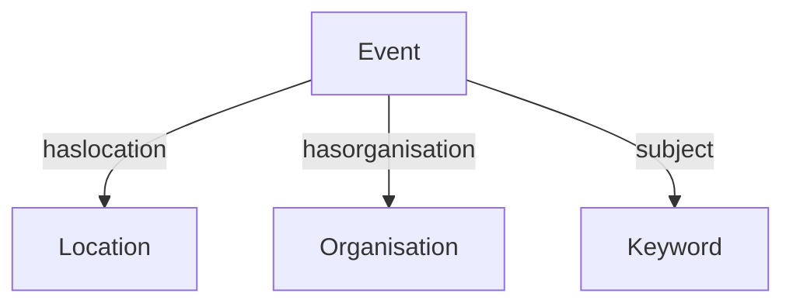

# 🌈 Queer Calendar

**A community-driven, open source calendar for queer events in, for the moment, Amsterdam.**

Queer Calendar is a grassroots initiative to centralize LGBTQIA+ event listings in one inclusive, accessible and privacy friendly web calendar. Whether you're looking for the next party, a workshop, or an activist meetup — this project aims to make it easy to stay connected **without relying on Big Tech & Social media**.

👉 **Live site**: [queer-kalendar.nl](https://queer-kalendar.nl)

---

## ✨ Features

- 📅 Overview of upcoming events
- 🌙 Dark mode
- 🌐 Multilingual support
- 🔍 Filter by date and keyword
- 📝 Community event entry (planned)

---

## 🚀 Roadmap

- [ ] Refactor to logical properties
- [ ] Add glossary explaining keywords
- [ ] Community event submission - allow users to add events
- [ ] Expand to other cities, think of a good UX
- [ ] Build an event scraper(?) for auto-imports (e.g. from Instagram posts)
- [ ] Integrate with a, possibly paid, newsletter system
- [ ] Allow sync with personal calendars (Google/iCal/ICS — user-controlled)

---

## ✅ Done So Far

- [x] Added filtering on keywords
- [x] Deployed first live version 🥳
- [x] Add popovers for keywords with explanations
- [x] Implement multilingual support
- [x] Finalize MVP
- [x] Add dark mode
- [x] Made open source for community collaboration
- [x] Initial frontend styling and layout
- [x] Project structure
- [x] Add filtering by date

---

## 🧠 Tech Stack

- [Zotonic](https://zotonic.com) – semantic web framework powering the backend
- HTML,CSS, JS – custom-styled frontend

Datamodel:

---

## 🤝 Contributing

We welcome contributions from anyone interested in queer tech, open source, or digital autonomy!

Check out [`CONTRIBUTING.md`](CONTRIBUTING.md) for guidelines on how to get started.

- Open an [issue](https://github.com/DorienD/queer-cal/issues) to suggest a feature or report a bug
- Fork the repo and submit a pull request
- Reach out if you'd like to collaborate on outreach, accessibility, design, or moderation

### 💡 Note

This project **intentionally avoids Google, Meta, and other corporate platforms** that have a poor track record on privacy, inclusion, or ethical data use. We aim to provide a *privacy-conscious, community-first alternative* to event discovery.

---

## ❤️ Support This Project

Queer Calendar is a labor of love — and your support makes a difference.
If you’d like to help sustain development and maintenance, consider becoming a **[GitHub Sponsor](https://github.com/sponsors/DorienD)**. Every bit helps. Thank you!

See [`SUPPORT.md`](SUPPORT.md) for more ways to help.

---

## 📬 Contact

Questions, ideas, or event tips?
→ events@queer-kalender.nl

---

> 💌 Built with pride, community values, and digital care.
